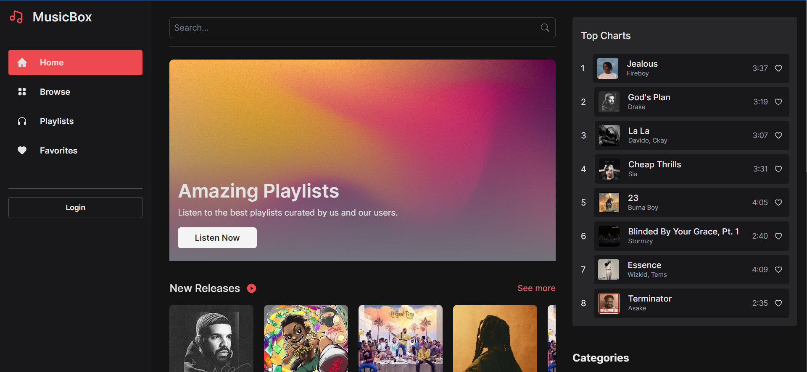

# MusicBox Music 🎵

###  [Live Demo](https://music-frontend-swart.vercel.app)

## Overview

Welcome to MusicBox, a music application that allows users to listen to music, save their favorite tracks to their accounts, and create awesome playlists. This application is built using the MERN stack (MongoDB, Express.js, React, Node.js) and is deployed on Vercel.

This is the frontend of the application.

## Technologies Used

Built on the MERN Stack with `NodeJs` `ReactJs` `Express` `Chakra UI` `Redux Toolkit` and `MongoDB` for Database Management and storage.

## Features
- User Registration: Users can create accounts to access personalized features.
- Music Playback: Users can listen to their favorite music tracks directly within the app.
- Account Management: Users can save their favorite tracks and create customized playlists.
- Playlist Creation: Users can create playlists and add their favorite tracks to them.
- Search Functionality: Users can search for specific tracks or artists.
- Responsive Design: The application is designed to be mobile-friendly and responsive on different devices.

Leave a ⭐️ If you like this project! 

## Screenshot

